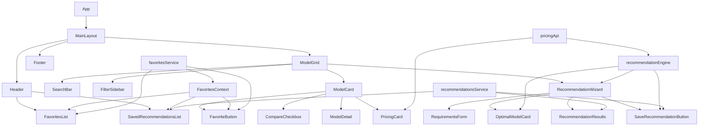

# AI Video Generation Models Directory - Architecture Plan

## Project Overview

Create an interactive directory website showcasing the best AI video generation models with filtering, search, comparison features, live pricing API integration, smart recommendation engine, and favorites/saved recommendations.

**Tech Stack:** React + Vite + LocalStorage Persistence

## Project Structure

```
ai-video-directory/
├── public/
│   └── assets/
│       └── images/
├── src/
│   ├── components/
│   │   ├── Layout/
│   │   │   ├── Header.jsx
│   │   │   ├── Footer.jsx
│   │   │   └── MainLayout.jsx
│   │   ├── Search/
│   │   │   ├── SearchBar.jsx
│   │   │   └── SearchResults.jsx
│   │   ├── Filters/
│   │   │   ├── FilterSidebar.jsx
│   │   │   └── FilterChip.jsx
│   │   ├── Models/
│   │   │   ├── ModelCard.jsx
│   │   │   ├── ModelGrid.jsx
│   │   │   └── ModelDetail.jsx
│   │   ├── Pricing/
│   │   │   ├── PricingCard.jsx
│   │   │   ├── PricingTable.jsx
│   │   │   └── PricingChart.jsx
│   │   ├── Comparison/
│   │   │   ├── ComparisonTable.jsx
│   │   │   └── CompareCheckbox.jsx
│   │   ├── Recommendation/
│   │   │   ├── RecommendationWizard.jsx
│   │   │   ├── RequirementsForm.jsx
│   │   │   ├── OptimalModelCard.jsx
│   │   │   └── RecommendationResults.jsx
│   │   └── Favorites/
│   │       ├── FavoriteButton.jsx
│   │       ├── FavoritesList.jsx
│   │       ├── SavedRecommendation.jsx
│   │       └── SavedRecommendationsList.jsx
│   ├── services/
│   │   ├── api/
│   │   │   ├── pricingApi.js
│   │   │   ├── modelsApi.js
│   │   │   └── apiClient.js
│   │   ├── transformers/
│   │   │   └── pricingTransformer.js
│   │   ├── recommendation/
│   │   │   ├── recommendationEngine.js
│   │   │   ├── scoringAlgorithm.js
│   │   │   └── priceOptimizer.js
│   │   └── storage/
│   │       ├── favoritesService.js
│   │       └── recommendationsService.js
│   ├── data/
│   │   ├── models.js
│   │   └── apiEndpoints.js
│   ├── hooks/
│   │   ├── useModels.js
│   │   ├── useFilters.js
│   │   ├── usePricing.js
│   │   ├── useRecommendations.js
│   │   └── useFavorites.js
│   ├── context/
│   │   ├── FilterContext.jsx
│   │   ├── PricingContext.jsx
│   │   └── FavoritesContext.jsx
│   ├── utils/
│   │   ├── comparison.js
│   │   ├── formatters.js
│   │   └── validators.js
│   ├── App.jsx
│   ├── App.css
│   └── main.jsx
├── index.html
├── package.json
├── vite.config.js
└── README.md
```

## Storage Services

### Favorites Service

```javascript
// services/storage/favoritesService.js

const FAVORITES_KEY = 'ai_video_favorites';
const MAX_FAVORITES = 20;

class FavoritesService {
  constructor() {
    this.favorites = this.load();
  }

  load() {
    try {
      const stored = localStorage.getItem(FAVORITES_KEY);
      return stored ? JSON.parse(stored) : [];
    } catch (error) {
      console.error('Error loading favorites:', error);
      return [];
    }
  }

  save() {
    try {
      localStorage.setItem(FAVORITES_KEY, JSON.stringify(this.favorites));
    } catch (error) {
      console.error('Error saving favorites:', error);
    }
  }

  add(model) {
    if (this.isFavorite(model.id)) return false;
    
    if (this.favorites.length >= MAX_FAVORITES) {
      // Remove oldest favorite
      this.favorites.shift();
    }
    
    const favorite = {
      ...model,
      addedAt: new Date().toISOString(),
      notes: ''
    };
    
    this.favorites.push(favorite);
    this.save();
    return true;
  }

  remove(modelId) {
    const index = this.favorites.findIndex(f => f.id === modelId);
    if (index === -1) return false;
    
    this.favorites.splice(index, 1);
    this.save();
    return true;
  }

  toggle(model) {
    return this.isFavorite(model.id) 
      ? this.remove(model.id) 
      : this.add(model);
  }

  isFavorite(modelId) {
    return this.favorites.some(f => f.id === modelId);
  }

  getAll() {
    return this.favorites;
  }

  updateNotes(modelId, notes) {
    const favorite = this.favorites.find(f => f.id === modelId);
    if (favorite) {
      favorite.notes = notes;
      favorite.updatedAt = new Date().toISOString();
      this.save();
    }
  }

  clear() {
    this.favorites = [];
    this.save();
  }

  export() {
    return JSON.stringify(this.favorites, null, 2);
  }

  import(data) {
    try {
      const imported = JSON.parse(data);
      if (Array.isArray(imported)) {
        this.favorites = imported.slice(0, MAX_FAVORITES);
        this.save();
        return true;
      }
    } catch (error) {
      console.error('Error importing favorites:', error);
    }
    return false;
  }
}

export const favoritesService = new FavoritesService();
```

### Saved Recommendations Service

```javascript
// services/storage/recommendationsService.js

const RECOMMENDATIONS_KEY = 'ai_video_recommendations';
const MAX_RECOMMENDATIONS = 10;

class RecommendationsService {
  constructor() {
    this.recommendations = this.load();
  }

  load() {
    try {
      const stored = localStorage.getItem(RECOMMENDATIONS_KEY);
      return stored ? JSON.parse(stored) : [];
    } catch (error) {
      console.error('Error loading recommendations:', error);
      return [];
    }
  }

  save() {
    try {
      localStorage.setItem(RECOMMENDATIONS_KEY, JSON.stringify(this.recommendations));
    } catch (error) {
      console.error('Error saving recommendations:', error);
    }
  }

  saveRecommendation(requirements, result) {
    const recommendation = {
      id: `rec_${Date.now()}`,
      requirements: { ...requirements },
      optimal: result.optimal,
      alternatives: result.alternatives,
      analysis: result.analysis,
      createdAt: new Date().toISOString(),
      name: this.generateName(requirements)
    };

    // Remove duplicates with same requirements
    this.recommendations = this.recommendations.filter(
      r => JSON.stringify(r.requirements) !== JSON.stringify(requirements)
    );

    this.recommendations.unshift(recommendation);
    
    // Limit stored recommendations
    if (this.recommendations.length > MAX_RECOMMENDATIONS) {
      this.recommendations = this.recommendations.slice(0, MAX_RECOMMENDATIONS);
    }
    
    this.save();
    return recommendation;
  }

  generateName(requirements) {
    const parts = [];
    
    if (requirements.budget) {
      parts.push(`$${requirements.budget} budget`);
    }
    
    if (requirements.features && requirements.features.length > 0) {
      const featureNames = requirements.features.slice(0, 2).join(', ');
      parts.push(`${featureNames} focus`);
    }
    
    if (requirements.useCase) {
      parts.push(requirements.useCase);
    }
    
    return parts.length > 0 ? parts.join(' - ') : 'Custom recommendation';
  }

  delete(id) {
    const index = this.recommendations.findIndex(r => r.id === id);
    if (index === -1) return false;
    
    this.recommendations.splice(index, 1);
    this.save();
    return true;
  }

  getAll() {
    return this.recommendations;
  }

  getById(id) {
    return this.recommendations.find(r => r.id === id);
  }

  clear() {
    this.recommendations = [];
    this.save();
  }

  export() {
    return JSON.stringify(this.recommendations, null, 2);
  }

  import(data) {
    try {
      const imported = JSON.parse(data);
      if (Array.isArray(imported)) {
        this.recommendations = imported.slice(0, MAX_RECOMMENDATIONS);
        this.save();
        return true;
      }
    } catch (error) {
      console.error('Error importing recommendations:', error);
    }
    return false;
  }
}

export const recommendationsService = new RecommendationsService();
```

## Favorites Context

```javascript
// context/FavoritesContext.jsx

import { createContext, useContext, useState, useEffect } from 'react';
import { favoritesService } from '../services/storage/favoritesService';

const FavoritesContext = createContext(null);

export function FavoritesProvider({ children }) {
  const [favorites, setFavorites] = useState([]);
  const [isLoading, setIsLoading] = useState(true);

  useEffect(() => {
    setFavorites(favoritesService.getAll());
    setIsLoading(false);
  }, []);

  const addFavorite = (model) => {
    const success = favoritesService.add(model);
    if (success) {
      setFavorites(favoritesService.getAll());
      return true;
    }
    return false;
  };

  const removeFavorite = (modelId) => {
    const success = favoritesService.remove(modelId);
    if (success) {
      setFavorites(favoritesService.getAll());
    }
    return success;
  };

  const toggleFavorite = (model) => {
    const success = favoritesService.toggle(model);
    setFavorites(favoritesService.getAll());
    return success;
  };

  const isFavorite = (modelId) => {
    return favoritesService.isFavorite(modelId);
  };

  const updateNotes = (modelId, notes) => {
    favoritesService.updateNotes(modelId, notes);
    setFavorites(favoritesService.getAll());
  };

  const clearFavorites = () => {
    favoritesService.clear();
    setFavorites([]);
  };

  const exportFavorites = () => {
    return favoritesService.export();
  };

  return (
    <FavoritesContext.Provider value={{
      favorites,
      isLoading,
      addFavorite,
      removeFavorite,
      toggleFavorite,
      isFavorite,
      updateNotes,
      clearFavorites,
      exportFavorites
    }}>
      {children}
    </FavoritesContext.Provider>
  );
}

export function useFavorites() {
  const context = useContext(FavoritesContext);
  if (!context) {
    throw new Error('useFavorites must be used within a FavoritesProvider');
  }
  return context;
}
```

## Components

### FavoriteButton

```javascript
// components/Favorites/FavoriteButton.jsx

import { useFavorites } from '../../context/FavoritesContext';

export function FavoriteButton({ model, size = 'medium' }) {
  const { isFavorite, toggleFavorite } = useFavorites();
  const isFav = isFavorite(model.id);

  const sizes = {
    small: '16px',
    medium: '24px',
    large: '32px'
  };

  return (
    <button
      onClick={() => toggleFavorite(model)}
      className={`favorite-button ${isFav ? 'active' : ''}`}
      aria-label={isFav ? 'Remove from favorites' : 'Add to favorites'}
      title={isFav ? 'Remove from favorites' : 'Add to favorites'}
    >
      <svg 
        width={sizes[size]} 
        height={sizes[size]} 
        viewBox="0 0 24 24"
        fill={isFav ? '#FFD700' : 'none'}
        stroke={isFav ? '#FFD700' : 'currentColor'}
        strokeWidth="2"
      >
        <path d="M12 2l3.09 6.26L22 9.27l-5 4.87 1.18 6.88L12 17.77l-6.18 3.25L7 14.14 2 9.27l6.91-1.01L12 2z" />
      </svg>
    </button>
  );
}
```

### SavedRecommendation

```javascript
// components/Favorites/SavedRecommendation.jsx

import { useState } from 'react';
import { useRecommendations } from '../../hooks/useRecommendations';
import { OptimalModelCard } from '../Recommendation/OptimalModelCard';

export function SavedRecommendation({ recommendation }) {
  const { deleteRecommendation, loadRecommendation } = useRecommendations();
  const [isExpanded, setIsExpanded] = useState(false);

  return (
    <div className="saved-recommendation">
      <div className="saved-recommendation-header">
        <div className="saved-recommendation-info">
          <h4>{recommendation.name}</h4>
          <span className="saved-date">
            {new Date(recommendation.createdAt).toLocaleDateString()}
          </span>
        </div>
        <div className="saved-recommendation-actions">
          <button 
            onClick={() => loadRecommendation(recommendation)}
            className="btn-secondary"
          >
            Load
          </button>
          <button 
            onClick={() => deleteRecommendation(recommendation.id)}
            className="btn-danger"
          >
            Delete
          </button>
          <button 
            onClick={() => setIsExpanded(!isExpanded)}
            className="btn-toggle"
          >
            {isExpanded ? 'Hide' : 'Show'} Details
          </button>
        </div>
      </div>

      {isExpanded && (
        <div className="saved-recommendation-details">
          <div className="requirements-summary">
            <h5>Requirements:</h5>
            <ul>
              {recommendation.requirements.budget && (
                <li>Budget: ${recommendation.requirements.budget}/mo</li>
              )}
              {recommendation.requirements.features?.map(f => (
                <li key={f}>{f}</li>
              ))}
            </ul>
          </div>

          <div className="optimal-model">
            <h5>Recommended Model:</h5>
            <OptimalModelCard 
              model={recommendation.optimal.model}
              pricing={recommendation.optimal.pricing}
              analysis={recommendation.optimal.analysis}
            />
          </div>

          <div className="alternatives">
            <h5>Alternatives:</h5>
            {recommendation.alternatives?.map(alt => (
              <OptimalModelCard 
                key={alt.model.id}
                model={alt.model}
                pricing={alt.pricing}
                isAlternative
              />
            ))}
          </div>
        </div>
      )}
    </div>
  );
}
```

## API Integration Layer

### API Endpoints Configuration

```javascript
// data/apiEndpoints.js
export const API_ENDPOINTS = {
  runway: {
    pricing: 'https://api.runwayml.com/v1/pricing',
    auth: 'https://api.runwayml.com/v1/auth',
    rateLimit: 100
  },
  openai: {
    pricing: 'https://api.openai.com/v1/models/sora/pricing',
    auth: 'https://api.openai.com/v1/auth',
    rateLimit: 60
  },
  google: {
    pricing: 'https://aistudio.google.com/api/pricing/veo2',
    auth: 'https://aistudio.google.com/api/auth',
    rateLimit: 120
  },
  luma: {
    pricing: 'https://api.lumalabs.ai/v1/pricing',
    auth: 'https://api.lumalabs.ai/v1/auth',
    rateLimit: 100
  },
  stability: {
    pricing: 'https://api.stability.ai/v1/pricing',
    auth: 'https://api.stability.ai/v1/auth',
    rateLimit: 60
  },
  kling: {
    pricing: 'https://api.klingai.com/v1/pricing',
    auth: 'https://api.klingai.com/v1/auth',
    rateLimit: 80
  },
  minmax: {
    pricing: 'https://api.minimaxi.com/v1/pricing/hailuo',
    auth: 'https://api.minimaxi.com/v1/auth',
    rateLimit: 100
  },
  byteDance: {
    pricing: 'https://api.bytedance.com/v1/pricing/pyramid',
    auth: 'https://api.bytedance.com/v1/auth',
    rateLimit: 90
  }
};
```

## Recommendation Engine

### Scoring Algorithm

```javascript
// services/recommendation/scoringAlgorithm.js

export function calculateModelScore(model, requirements, pricingData) {
  let score = 0;
  const weights = {
    featureMatch: 30,
    pricePerformance: 25,
    quality: 20,
    popularity: 15,
    easeOfUse: 10
  };

  const featureMatch = calculateFeatureMatch(model, requirements);
  score += featureMatch * weights.featureMatch;

  const pricePerformance = calculatePricePerformance(model, pricingData, requirements);
  score += pricePerformance * weights.pricePerformance;

  const quality = calculateQualityScore(model);
  score += quality * weights.quality;

  const popularity = model.popular ? 100 : 50;
  score += (popularity / 100) * weights.popularity;

  const easeOfUse = model.rating || 3;
  score += (easeOfUse / 5) * weights.easeOfUse;

  return Math.round(score);
}
```

## Data Model Structure

```javascript
// AI Video Model Data Schema
{
  id: string,
  name: string,
  provider: string,
  description: string,
  website: string,
  apiEndpoint: string,
  pricing: {
    free: boolean,
    tier: string,
    startingPrice: number,
    subscriptions: [],
    payAsYouGo: {}
  },
  features: {
    textToVideo: boolean,
    imageToVideo: boolean,
    videoToVideo: boolean,
    lipSync: boolean,
    cameraControl: boolean,
    styleTransfer: boolean,
    duration: number,
    resolution: string[],
    fps: number
  },
  strengths: string[],
  limitations: string[],
  useCases: string[],
  rating: number,
  popular: boolean,
  launchDate: string,
  tags: string[]
}
```

## AI Video Models to Include (2024-2025)

1. **Sora** (OpenAI)
2. **Veo 2** (Google)
3. **Gen-3 Alpha** (Runway)
4. **Pika Labs** (Pika)
5. **Luma Dream Machine** (Luma AI)
6. **Kling** (Kuaishou)
7. **Hailuo** (MiniMax)
8. **Runway Gen-2** (Runway)
9. **Stable Video Diffusion** (Stability AI)
10. **Pyramid Flow** (ByteDance)
11. **Wan 2.1** (Alibaba)
12. **HunyuanVideo** (Tencent)
13. **MovieGen** (Meta)
14. **Step-Video** (StepFun)
15. **SkyReels** (Skybox Labs)

## Component Architecture



## Features Breakdown

### 1. Favorites System

- Add/remove models to favorites
- Persistent storage (localStorage)
- Add notes to saved models
- Export favorites list
- Import favorites
- Max 20 favorites

### 2. Saved Recommendations

- Save recommendation results with requirements
- Auto-generated names based on requirements
- Load saved recommendations
- Export/import recommendations
- Max 10 saved recommendations

### 3. Smart Recommendation Wizard

- Multi-step requirements form
- Budget slider with real-time feedback
- Feature selection checklist
- Quality preferences
- Use case selection

### 4. Optimal Model Routing

- Match requirements to model capabilities
- Calculate best price-performance ratio
- Suggest optimal pricing tier
- Provide confidence score
- Show alternatives with trade-offs

### 5. Live Pricing Integration

- Fetch real-time pricing from provider APIs
- Display pricing tiers, credits, subscriptions
- Currency conversion support
- Price comparison charts
- Caching and rate limiting

### 6. Search & Filtering

- Real-time search by name, provider, description
- Filter by pricing, features, resolution, duration
- Rating and popularity filters

### 7. Comparison Feature

- Select up to 3 models to compare
- Side-by-side pricing and feature comparison
- Highlight best value option

## Styling Approach

- Clean, modern design
- Responsive layout (mobile-first)
- Dark/light mode support
- Accessible color contrast
- Smooth animations and transitions
- Price highlights and recommendation badges
- Favorite indicator (gold star)

## Implementation Phases

### Phase 1: Setup & Data

- Initialize React + Vite project
- Create data models and sample data
- Set up API configuration

### Phase 2: Storage Services

- Build FavoritesService with localStorage
- Build RecommendationsService with localStorage
- Create FavoritesContext
- Create useFavorites hook

### Phase 3: API Integration Layer

- Build API client with rate limiting
- Create pricing transformer
- Implement caching strategy
- Add fallback data

### Phase 4: Core Components

- Build Layout components
- Create ModelCard and ModelGrid
- Implement PricingCard component
- Add FavoriteButton component

### Phase 5: Recommendation Engine

- Build scoring algorithm
- Create price optimizer
- Implement recommendation engine
- Build RequirementsForm component

### Phase 6: Favorites UI

- Build FavoritesList component
- Build SavedRecommendationsList component
- Create SavedRecommendation component
- Add export/import functionality

### Phase 7: Search & Filters

- Build SearchBar component
- Create FilterSidebar
- Implement filter logic with context

### Phase 8: Detail & Comparison

- Create ModelDetail view
- Build PricingTable and PricingChart
- Add comparison functionality

### Phase 9: Polish

- Add animations
- Improve styling
- Test responsiveness
- Final bug fixes
