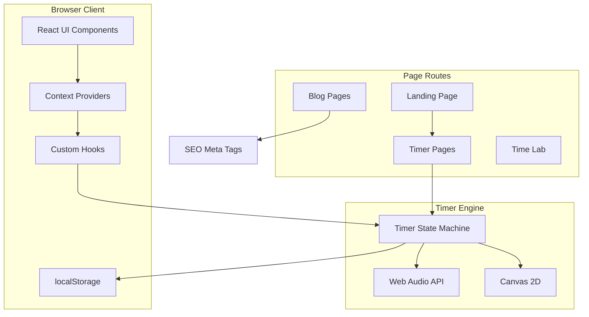
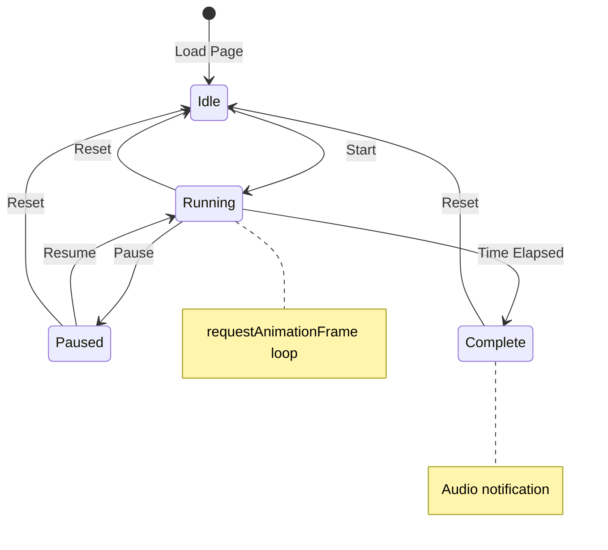
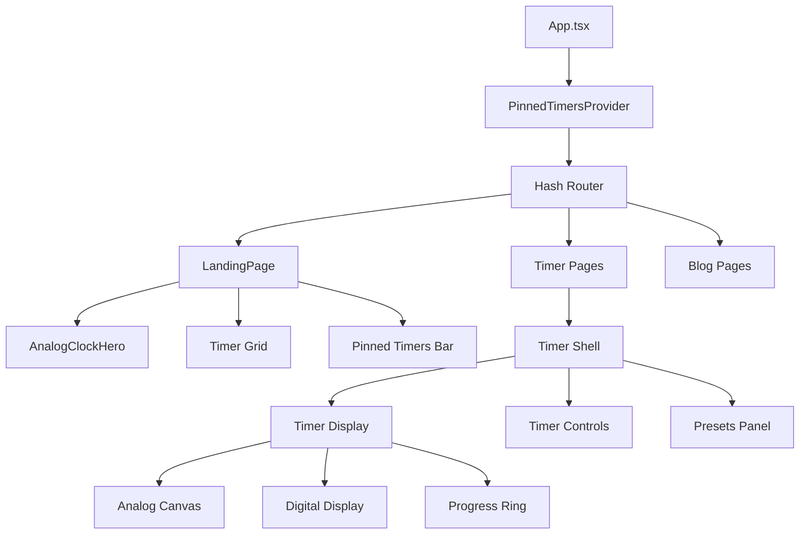

# Timer Curation Project - Technical Specification Document

## Executive Summary

This document defines the comprehensive technical specification for merging the Stoppclock-page React/TypeScript repository with the mytimesite.html vanilla HTML/CSS/JS implementation into a unified, production-ready timer collection platform.

---

## 1. Codebase Analysis Summary

### 1.1 Stoppclock-page Repository Architecture

**Technology Stack:**

- **Framework:** React 18.3.1 with TypeScript 5.6.3
- **Build Tool:** Vite 5.4.10 with SWC plugin
- **Routing:** Hash-based client-side routing
- **Testing:** Vitest 4.0.18 + Playwright 1.48.0
- **UI Library:** Lucide React 0.552.0 for icons
- **Styling:** CSS with design tokens system

**Timer Types Implemented:**

| Timer ID | Label | Route | Key Features |
|----------|-------|-------|--------------|
| `countdown` | Countdown | `#/countdown` | Digital countdown with presets |
| `stopwatch` | Stopwatch | `#/stopwatch` | Lap times, elapsed tracking |
| `analog` | Analog Clock | `#/analog` | Canvas-based analog display with moving hands |
| `timesince` | Time Since | `#/timesince` | Elapsed time tracker |
| `pomodoro` | Pomodoro | `#/pomodoro` | 25/5/15 min cycles, phase tracking |
| `cooking` | Cooking Timer | `#/cooking` | Kitchen presets, multiple timers |
| `couples` | Couples Timer | `#/couples` | Dual timer for fair time sharing |
| `chess` | Chess Clock | `#/chess` | Fischer/Bronstein/Simple modes |
| `metronome` | Metronome | `#/metronome` | BPM control, time signatures |
| `world` | World Clock | `#/world` | Multiple timezone display |
| `alarm` | Alarm | `#/alarm` | Set future time alerts |
| `digital` | Digital Clock | `#/digital` | Current time display |
| `breathing` | Breathing Timer | `#/breathing` | Guided breathing exercises |
| `interval` | Interval Timer | `#/interval` | HIIT/workout intervals |
| `custom-session` | Custom Session | `#/custom-sessions` | User-defined timer sequences |

**Key Components:**

- [`AnalogClockHero.tsx`](Stoppclock-page/src/components/AnalogClockHero.tsx) - Canvas-based analog clock with particle effects
- [`CountdownRing.tsx`](Stoppclock-page/src/components/CountdownRing.tsx) - SVG progress ring component
- [`PinnedTimersContext.tsx`](Stoppclock-page/src/contexts/PinnedTimersContext.tsx) - State management for pinned timers
- [`useSEO.ts`](Stoppclock-page/src/hooks/useSEO.ts) - Dynamic SEO meta tag management

### 1.2 mytimesite.html Architecture

**Technology Stack:**

- **Framework:** Vanilla HTML/CSS/JavaScript (no build step)
- **Styling:** Tailwind CSS via CDN + custom CSS
- **Fonts:** Google Fonts (Inter, JetBrains Mono)
- **Audio:** Web Audio API for sound notifications

**Timer Types Implemented:**

| Timer ID | Default Duration | Use Case |
|----------|------------------|----------|
| `pomodoro` | 25:00 | Classic Pomodoro technique |
| `flow` | 90:00 | Deep work sessions |
| `micro` | 05:00 | Short breaks |
| `deepwork` | 120:00 | Extended focus periods |
| `meeting` | 30:00 | Meeting time limits |
| `creative` | 45:00 | Creative work sessions |
| `exercise` | 45:00 | Workout timing |
| `meditation` | 20:00 | Mindfulness practice |
| `reading` | 60:00 | Reading sessions |
| `nap` | 20:00 | Power naps |
| `sprint` | 15:00 | Focus sprints |
| `shutdown` | 10:00 | End-of-day routine |

**Key Features:**

- Glassmorphism UI with aurora background animations
- Task management with localStorage persistence
- World clock for 8 cities
- Time perception test experiment
- Chronotype analysis visualization
- Breathing guidance overlay

---

## 2. Merged Project Architecture

### 2.1 Technology Decisions

**Primary Stack (from Stoppclock-page):**

```
React 18.3.1 + TypeScript 5.6.3 + Vite 5.4.10
```

**Rationale:**

- Type safety for complex timer state management
- Component reusability across timer types
- Code splitting for optimal loading performance
- Established testing infrastructure

**Integrated from mytimesite.html:**

- Glassmorphism CSS effects and aurora animations
- Task management system with streak tracking
- Time Lab experiments (perception test, chronotype)
- Additional timer presets (Flow State, Deep Work, etc.)

### 2.2 Project Structure

```
timer-collection/
|-- src/
|   |-- components/
|   |   |-- analog/           # Analog timer components
|   |   |-- digital/          # Digital display components
|   |   |-- layout/           # AppShell, Navigation
|   |   |-- shared/           # Reusable UI components
|   |   |-- tasks/            # Task management system
|   |   |-- world-clock/      # World clock components
|   |   `-- experiments/      # Time Lab experiments
|   |-- contexts/
|   |   |-- TimerContext.tsx  # Unified timer state
|   |   |-- TaskContext.tsx   # Task management state
|   |   `-- SettingsContext.tsx
|   |-- domain/
|   |   |-- timer/            # Timer logic and types
|   |   |-- tasks/            # Task domain logic
|   |   `-- analytics/        # Stats and tracking
|   |-- hooks/
|   |   |-- useTimer.ts       # Core timer hook
|   |   |-- useAnalogClock.ts # Canvas animation hook
|   |   |-- useAudio.ts       # Sound notifications
|   |   `-- useStorage.ts     # localStorage abstraction
|   |-- pages/
|   |   |-- LandingPage.tsx
|   |   |-- timer/            # Individual timer pages
|   |   |-- blog/             # SEO content pages
|   |   `-- lab/              # Time Lab experiments
|   |-- styles/
|   |   |-- design-tokens.css # CSS custom properties
|   |   |-- glassmorphism.css # Aurora/glass effects
|   |   `-- animations.css    # Keyframe animations
|   |-- types/
|   |   |-- timer-types.ts    # Timer state interfaces
|   |   |-- task-types.ts     # Task interfaces
|   |   `-- preset-types.ts   # Preset configurations
|   `-- utils/
|       |-- audio.ts          # Web Audio API utilities
|       |-- time.ts           # Time formatting
|       `-- storage.ts        # Persistence helpers
|-- public/
|   |-- fonts/                # Self-hosted fonts
|   |-- sounds/               # Notification sounds
|   `-- icons/                # PWA icons
|-- tests/
|   |-- unit/                 # Vitest tests
|   `-- e2e/                  # Playwright tests
|-- docs/
|   |-- api/                  # Component documentation
|   `-- guides/               # Usage guides
`-- package.json
```

---

## 3. Timer Types Specification

### 3.1 Complete Timer Collection

The merged project will include **20 distinct timer types** organized into categories:

#### Category A: Core Timers

| Timer Type | ID | Default Duration | Key Features |
|------------|-----|------------------|--------------|
| **Countdown** | `countdown` | 5:00 | Custom duration, presets, progress ring |
| **Stopwatch** | `stopwatch` | N/A | Lap times, split times, export |
| **Analog Countdown** | `analog` | 5:00 | Canvas-based clock face, moving hands |
| **Time Since** | `timesince` | N/A | Event tracking, persistent elapsed time |
| **Digital Clock** | `digital` | N/A | Current time, multiple formats |

#### Category B: Productivity Timers

| Timer Type | ID | Default Duration | Key Features |
|------------|-----|------------------|--------------|
| **Pomodoro** | `pomodoro` | 25:00 | 4-phase cycles, break tracking, streaks |
| **Flow State** | `flow` | 90:00 | Extended focus, session logging |
| **Deep Work** | `deepwork` | 120:00 | Cal Newport methodology, distraction logging |
| **Focus Sprint** | `sprint` | 15:00 | Quick focus bursts |
| **Meeting Timer** | `meeting` | 30:00 | Time-boxed meetings, warning alerts |

#### Category C: Wellness Timers

| Timer Type | ID | Default Duration | Key Features |
|------------|-----|------------------|--------------|
| **Meditation** | `meditation` | 20:00 | Guided sessions, ambient sounds |
| **Breathing** | `breathing` | Variable | 4-7-8, box breathing, visual guides |
| **Power Nap** | `nap` | 20:00 | Wake-up alarm, gradual alert |
| **Micro Break** | `micro` | 5:00 | Stand reminders, stretch prompts |

#### Category D: Activity Timers

| Timer Type | ID | Default Duration | Key Features |
|------------|-----|------------------|--------------|
| **Cooking Timer** | `cooking` | Variable | Multiple simultaneous timers, recipe presets |
| **Exercise/Interval** | `interval` | Variable | HIIT, Tabata, custom intervals |
| **Reading Timer** | `reading` | 60:00 | Page tracking, session goals |

#### Category E: Specialty Timers

| Timer Type | ID | Default Duration | Key Features |
|------------|-----|------------------|--------------|
| **Chess Clock** | `chess` | 10:00 | Fischer, Bronstein, delay modes |
| **Couples Timer** | `couples` | Variable | Fair time sharing, turn tracking |
| **Metronome** | `metronome` | N/A | BPM 20-240, time signatures, accent beats |
| **World Clock** | `world` | N/A | 12+ cities, timezone converter |
| **Alarm** | `alarm` | N/A | Future time alerts, recurring alarms |

### 3.2 Timer Feature Matrix

Each timer must implement the following feature set:

```
Core Features (Required for ALL timers):
[--] Start/Pause/Resume functionality
[--] Reset to initial state
[--] Visual progress indicator
[--] Audio notification on completion
[--] State persistence across page refresh
[--] Shareable via URL parameters
[--] Keyboard shortcuts (Space, R, Esc)

Enhanced Features (Per timer type):
[--] Analog display: Canvas-based with 60fps hand movement
[--] Digital display: Large monospace font with glow effect
[--] Presets: Quick-select common durations
[--] Custom duration: User input for any time value
[--] Lap/Split: Record intermediate times
[--] Statistics: Track usage over time
[--] Dark/Light theme: Automatic and manual toggle
```

---

## 4. Design System Specification

### 4.1 Color Palette (Deep Ocean Aurora Theme)

**Primary Colors:**

```css
/* Background Scale */
--ocean-deep: #0A1628;     /* Primary background - 18.13:1 contrast */
--ocean-dark: #1A2942;     /* Secondary background - 14.59:1 contrast */
--ocean-mid: #2D4263;      /* Elevated surfaces - 10.14:1 contrast */
--ocean-light: #4A6FA5;    /* Borders, muted - 5.11:1 contrast */
--ocean-bright: #6B9BD1;   /* Hover states */

/* Accent Colors */
--aurora-cyan: #00D9FF;    /* Primary accent - CTAs, highlights */
--aurora-purple: #7B2CBF;  /* Secondary accent */
--aurora-lavender: #C77DFF; /* Tertiary accent */
--aurora-pink: #E0AAFF;    /* Subtle highlights */

/* Semantic Colors */
--semantic-success: #10B981; /* Running, active states */
--semantic-warning: #F59E0B; /* Warning, low time */
--semantic-error: #EF4444;   /* Error, stopped */

/* Text Colors */
--text-primary: #FFFFFF;     /* Primary text */
--text-secondary: #E2E8F0;   /* Secondary text */
--text-muted: #94A3B8;       /* Muted, disabled */
```

### 4.2 Typography Scale

**Font Families:**

```css
--font-sans: 'Inter', -apple-system, BlinkMacSystemFont, sans-serif;
--font-mono: 'JetBrains Mono', 'SF Mono', monospace;
```

**Type Scale (1.5x Modular Ratio):**

```css
--type-xs: 0.75rem;    /* 12px - Labels, captions */
--type-sm: 0.875rem;   /* 14px - Secondary text */
--type-base: 1rem;     /* 16px - Body text */
--type-lg: 1.5rem;     /* 24px - H3, large labels */
--type-xl: 2rem;       /* 32px - H2, section headers */
--type-2xl: 3rem;      /* 48px - H1, page titles */
--type-3xl: 4rem;      /* 64px - Hero displays */
--type-4xl: 6rem;      /* 96px - Timer displays */
--type-5xl: 8rem;      /* 128px - Large timer displays */
```

**Font Weights:**

```css
--font-light: 300;     /* Timer displays, hero text */
--font-regular: 400;   /* Body text */
--font-medium: 500;    /* Labels, emphasis */
--font-bold: 700;      /* Headings, CTAs */
```

### 4.3 Spacing System

**Base Unit: 4px (0.25rem)**

```css
--space-1: 0.25rem;   /* 4px */
--space-2: 0.5rem;    /* 8px */
--space-3: 0.75rem;   /* 12px */
--space-4: 1rem;      /* 16px - Base */
--space-6: 1.5rem;    /* 24px */
--space-8: 2rem;      /* 32px */
--space-12: 3rem;     /* 48px */
--space-16: 4rem;     /* 64px */
--space-24: 6rem;     /* 96px */
```

### 4.4 Border Radius

```css
--radius-none: 0;
--radius-sm: 2px;     /* Minimal rounding */
--radius-md: 4px;     /* Buttons, inputs */
--radius-lg: 8px;     /* Cards */
--radius-xl: 12px;    /* Large cards */
--radius-2xl: 16px;   /* Modal containers */
--radius-full: 9999px; /* Circular elements */
```

### 4.5 Glassmorphism Effects

**Glass Panel:**

```css
.glass-panel {
  background: rgba(255, 255, 255, 0.03);
  backdrop-filter: blur(20px);
  -webkit-backdrop-filter: blur(20px);
  border: 1px solid rgba(255, 255, 255, 0.08);
  box-shadow: 
    0 8px 32px rgba(0, 0, 0, 0.3),
    inset 0 1px 0 rgba(255, 255, 255, 0.05);
}
```

**Aurora Background:**

```css
.aurora-bg {
  background:
    radial-gradient(ellipse at 20% 80%, rgba(56, 189, 248, 0.15) 0%, transparent 50%),
    radial-gradient(ellipse at 80% 20%, rgba(139, 92, 246, 0.1) 0%, transparent 50%),
    radial-gradient(ellipse at 50% 50%, rgba(6, 182, 212, 0.08) 0%, transparent 60%),
    linear-gradient(180deg, #0f172a 0%, #1e293b 100%);
  animation: auroraFlow 20s ease-in-out infinite;
}
```

---

## 5. Responsive Design Specification

### 5.1 Breakpoint System

| Breakpoint | Width | Target Devices |
|------------|-------|-----------------|
| `xs` | 320px | Small phones (iPhone SE) |
| `sm` | 640px | Large phones (iPhone Pro Max) |
| `md` | 768px | Tablets portrait |
| `lg` | 1024px | Tablets landscape, small laptops |
| `xl` | 1280px | Standard laptops |
| `2xl` | 1440px | Large monitors |
| `3xl` | 1920px | Full HD displays |

### 5.2 Mobile-First CSS Structure

```css
/* Base: Mobile (320px+) */
.timer-display {
  font-size: var(--type-3xl);  /* 64px */
  padding: var(--space-4);
}

/* sm: 640px */
@media (min-width: 640px) {
  .timer-display {
    font-size: var(--type-4xl);  /* 96px */
  }
}

/* md: 768px */
@media (min-width: 768px) {
  .timer-display {
    font-size: var(--type-4xl);
    padding: var(--space-8);
  }
}

/* lg: 1024px */
@media (min-width: 1024px) {
  .timer-display {
    font-size: var(--type-5xl);  /* 128px */
  }
}

/* xl: 1280px */
@media (min-width: 1280px) {
  .timer-grid {
    grid-template-columns: repeat(4, 1fr);
  }
}

/* 2xl: 1440px */
@media (min-width: 1440px) {
  .container {
    max-width: 1400px;
  }
}
```

### 5.3 Touch Target Requirements

- Minimum touch target: 44x44px (WCAG 2.1)
- Minimum spacing between targets: 8px
- Swipe gestures for timer control (left/right for presets)

---

## 6. Performance Benchmarks

### 6.1 Core Web Vitals Targets

| Metric | Target | Measurement Method |
|--------|--------|-------------------|
| **LCP** (Largest Contentful Paint) | < 2.5s | Lighthouse, PageSpeed Insights |
| **FID** (First Input Delay) | < 100ms | Chrome User Experience Report |
| **CLS** (Cumulative Layout Shift) | < 0.1 | Lighthouse |
| **INP** (Interaction to Next Paint) | < 200ms | Chrome DevTools |

### 6.2 Additional Performance Metrics

| Metric | Target |
|--------|--------|
| First Contentful Paint (FCP) | < 1.8s |
| Time to Interactive (TTI) | < 3.8s |
| Total Blocking Time (TBT) | < 200ms |
| Speed Index | < 3.4s |
| JavaScript bundle (gzipped) | < 150KB initial |
| CSS bundle (gzipped) | < 30KB |
| Time to First Byte (TTFB) | < 600ms |

### 6.3 Animation Performance

- **Analog clock hands:** 60fps using `requestAnimationFrame`
- **Progress rings:** CSS transitions with `will-change: transform`
- **Aurora background:** GPU-accelerated with `transform` and `opacity`
- **Particle effects:** Canvas 2D with object pooling

### 6.4 Optimization Strategies

```
[--] Code splitting per timer type (lazy loading)
[--] Tree shaking for unused components
[--] Image optimization: WebP with AVIF fallback
[--] Font subsetting for used characters only
[--] Critical CSS inlining for above-fold content
[--] Service Worker for offline caching
[--] Preconnect to Google Fonts CDN
[--] Resource hints: preload fonts, prefetch next pages
```

---

## 7. Accessibility Standards (WCAG 2.1 AA)

### 7.1 Perceivable

- **1.1.1 Non-text Content:** All icons have aria-labels
- **1.3.1 Info and Relationships:** Semantic HTML structure
- **1.4.1 Use of Color:** Information not conveyed by color alone
- **1.4.3 Contrast Minimum:** 4.5:1 for text, 3:1 for UI components
- **1.4.4 Resize Text:** Functional at 200% zoom
- **1.4.5 Images of Text:** No text in images except logos

### 7.2 Operable

- **2.1.1 Keyboard:** All functionality via keyboard
- **2.1.2 No Keyboard Trap:** Focus can navigate away
- **2.4.1 Bypass Blocks:** Skip navigation link
- **2.4.3 Focus Order:** Logical tab sequence
- **2.4.7 Focus Visible:** Clear focus indicators

### 7.3 Keyboard Shortcuts

| Key | Action | Context |
|-----|--------|---------|
| `Space` | Start/Pause | Timer active |
| `R` | Reset | Timer active |
| `S` | Skip phase | Pomodoro mode |
| `L` | Record lap | Stopwatch mode |
| `Esc` | Close modal | Modal open |
| `?` | Show shortcuts | Global |
| `1-9` | Quick preset | Timer selection |

### 7.4 Screen Reader Announcements

```typescript
// Timer state changes
announce(`Timer ${isRunning ? 'started' : 'paused'}. ${formatTime(remaining)} remaining.`);

// Phase completion
announce(`${timerName} complete. ${nextPhase ? `Starting ${nextPhase}.` : ''}`);

// Lap times
announce(`Lap ${lapNumber}: ${formatTime(lapTime)}`);
```

---

## 8. SEO Content Strategy

### 8.1 Keyword Research Framework

**Primary Keywords (High Volume, Medium Competition):**

| Keyword | Monthly Volume | Intent |
|---------|---------------|--------|
| online timer | 450K | Navigational |
| countdown timer | 301K | Navigational |
| pomodoro timer | 201K | Navigational |
| stopwatch online | 246K | Navigational |
| chess clock | 90K | Navigational |

**Long-tail Keywords (Lower Volume, High Intent):**

| Keyword | Monthly Volume | Intent |
|---------|---------------|--------|
| meditation timer with music | 12K | Transactional |
| hiit interval timer online | 8.1K | Transactional |
| cooking timer multiple timers | 6.6K | Transactional |
| focus timer with breaks | 4.4K | Transactional |
| couples timer for fair time sharing | 1.2K | Transactional |

### 8.2 Content Structure

**Blog Article Requirements:**

- Minimum 2,000 words per article
- H1/H2/H3 hierarchy with keyword-rich headings
- Meta description: 150-160 characters with CTA
- JSON-LD schema: HowTo, FAQ, SoftwareApplication
- Internal links: 5-10 per article
- External links: 2-3 authoritative sources
- Images: 3-5 with descriptive alt text

**Content Calendar (8 Articles):**

| # | Title | Target Keyword | Word Count |
|---|-------|---------------|------------|
| 1 | The Complete Guide to Pomodoro Technique | pomodoro technique | 2,500 |
| 2 | 10 Best Online Timers for Productivity | online timer | 2,200 |
| 3 | How to Use a Chess Clock: Rules and Strategies | chess clock | 2,000 |
| 4 | Interval Training: HIIT Timer Guide | hiit timer | 2,300 |
| 5 | Meditation Timers: Finding Your Peace | meditation timer | 2,100 |
| 6 | Cooking Timers: Never Burn Dinner Again | cooking timer | 1,900 |
| 7 | Time Blocking: The Ultimate Guide | time blocking | 2,400 |
| 8 | Stopwatch vs Countdown: When to Use Each | stopwatch countdown | 1,800 |

### 8.3 Schema Markup

**SoftwareApplication Schema:**

```json
{
  "@context": "https://schema.org",
  "@type": "SoftwareApplication",
  "name": "Timer Collection",
  "applicationCategory": "UtilitiesApplication",
  "operatingSystem": "Web Browser",
  "offers": {
    "@type": "Offer",
    "price": "0",
    "priceCurrency": "USD"
  },
  "aggregateRating": {
    "@type": "AggregateRating",
    "ratingValue": "4.8",
    "ratingCount": "1250"
  }
}
```

**HowTo Schema (for guides):**

```json
{
  "@context": "https://schema.org",
  "@type": "HowTo",
  "name": "How to Use the Pomodoro Timer",
  "step": [
    {
      "@type": "HowToStep",
      "name": "Set your focus duration",
      "text": "Choose 25 minutes for standard Pomodoro or customize"
    },
    {
      "@type": "HowToStep", 
      "name": "Work until the timer rings",
      "text": "Focus on a single task without distractions"
    }
  ]
}
```

---

## 9. Error Handling & Edge Cases

### 9.1 System Events

| Event | Handling Strategy |
|-------|------------------|
| **Tab backgrounding** | Store `endAt` timestamp, recalculate on visibility change |
| **System sleep/wake** | Compare `Date.now()` with expected `endAt`, adjust state |
| **Network interruption** | Local-only timers continue, sync on reconnect |
| **localStorage quota exceeded** | Fallback to sessionStorage, warn user |
| **Audio context suspended** | Resume on first user interaction |

### 9.2 Timer Edge Cases

```typescript
// Negative time prevention
if (remainingMs < 0) {
  remainingMs = 0;
  onTimerComplete();
}

// Maximum duration cap (24 hours)
const MAX_DURATION = 24 * 60 * 60 * 1000;
if (durationMs > MAX_DURATION) {
  durationMs = MAX_DURATION;
  notifyUser('Duration capped at 24 hours');
}

// Zero duration handling
if (durationMs === 0) {
  showError('Please set a duration greater than zero');
  return;
}

// Clock change detection (DST, manual adjustment)
let lastNow = Date.now();
setInterval(() => {
  const now = Date.now();
  const delta = now - lastNow;
  if (Math.abs(delta) > 5000 && Math.abs(delta) < 1000) {
    // System clock changed significantly
    recalculateTimerEnd();
  }
  lastNow = now;
}, 1000);
```

### 9.3 Browser Compatibility

| Feature | Fallback |
|---------|----------|
| `requestAnimationFrame` | `setTimeout(fn, 16)` |
| `AudioContext` | HTML5 `<audio>` element |
| `localStorage` | In-memory storage with warning |
| `backdrop-filter` | Solid color overlay |
| CSS Grid | Flexbox fallback |

---

## 10. Deployment Architecture

### 10.1 Hosting Platform

**Recommended:** Vercel or Netlify

**Configuration:**

```yaml
# vercel.json
{
  "buildCommand": "npm run build",
  "outputDirectory": "dist",
  "framework": "vite",
  "headers": [
    {
      "source": "/(.*)",
      "headers": [
        { "key": "X-Content-Type-Options", "value": "nosniff" },
        { "key": "X-Frame-Options", "value": "DENY" },
        { "key": "X-XSS-Protection", "value": "1; mode=block" }
      ]
    },
    {
      "source": "/assets/(.*)",
      "headers": [
        { "key": "Cache-Control", "value": "public, max-age=31536000, immutable" }
      ]
    }
  ]
}
```

### 10.2 CI/CD Pipeline

```yaml
# .github/workflows/ci.yml
name: CI/CD Pipeline

on:
  push:
    branches: [main, develop]
  pull_request:
    branches: [main]

jobs:
  test:
    runs-on: ubuntu-latest
    steps:
      - uses: actions/checkout@v4
      - uses: actions/setup-node@v4
        with:
          node-version: '20'
          cache: 'npm'
      - run: npm ci
      - run: npm run test
      - run: npm run test:e2e

  lighthouse:
    runs-on: ubuntu-latest
    steps:
      - uses: actions/checkout@v4
      - run: npm run build
      - uses: treosh/lighthouse-ci-action@v10
        with:
          configPath: ./lighthouserc.json

  deploy:
    needs: [test, lighthouse]
    if: github.ref == 'refs/heads/main'
    runs-on: ubuntu-latest
    steps:
      - uses: actions/checkout@v4
      - run: npm run build
      - uses: amondnet/vercel-action@v25
        with:
          vercel-token: ${{ secrets.VERCEL_TOKEN }}
          vercel-org-id: ${{ secrets.VERCEL_ORG_ID }}
          vercel-project-id: ${{ secrets.VERCEL_PROJECT_ID }}
```

### 10.3 Lighthouse CI Configuration

```json
{
  "ci": {
    "collect": {
      "url": ["http://localhost:4173/", "http://localhost:4173/#/pomodoro"],
      "numberOfRuns": 3
    },
    "assert": {
      "assertions": {
        "categories:performance": ["error", { "minScore": 0.9 }],
        "categories:accessibility": ["error", { "minScore": 0.95 }],
        "categories:best-practices": ["error", { "minScore": 0.9 }],
        "categories:seo": ["error", { "minScore": 0.9 }]
      }
    }
  }
}
```

---

## 11. State Management Architecture

### 11.1 Design Rationale

The application uses **React Context API** with performance-optimized patterns instead of an external state library. This decision is driven by:

- Timer state is inherently local (no server sync)
- Context API eliminates external dependency overhead
- Sufficient for the application's complexity when properly optimized
- Reduces bundle size vs. Redux Toolkit (~12KB savings)

### 11.2 Context Provider Hierarchy

```
<StrictMode>
  <SettingsProvider>          ← Theme, preferences (rarely changes)
    <TaskProvider>            ← Task list, streaks (changes on user action)
      <TimerProvider>         ← Active timers (changes every frame)
        <PinnedTimersProvider> ← Pinned timer IDs (rarely changes)
          <App />
        </PinnedTimersProvider>
      </TimerProvider>
    </TaskProvider>
  </SettingsProvider>
</StrictMode>
```

**Ordering Rationale:** Outermost contexts change least frequently. This prevents re-renders of stable providers when fast-changing providers (TimerProvider) update.

### 11.3 State Shape Definitions

#### SettingsContext

```typescript
interface UserSettings {
  theme: 'dark' | 'light' | 'system';
  soundEnabled: boolean;
  soundType: 'chime' | 'bell' | 'beep' | 'custom';
  soundVolume: number;          // 0-1
  notificationsEnabled: boolean;
  use24HourFormat: boolean;
  showSeconds: boolean;
  defaultTimerDurations: Record<TimerTypeId, number>; // ms
  reducedMotion: boolean;
  lastVisitedTimer: TimerTypeId | null;
}

// Update frequency: LOW (user settings changes)
// Re-render impact: MINIMAL (mostly consumed by leaf components)
```

#### TaskContext

```typescript
interface Task {
  id: string;
  name: string;
  createdAt: number;            // Unix timestamp
  completedAt: number | null;
  timerType: TimerTypeId;
  estimatedPomodoros: number;
  completedPomodoros: number;
  isArchived: boolean;
}

interface TaskContextState {
  tasks: Task[];
  activeTaskId: string | null;
  streakDays: number;
  lastActiveDate: string;       // ISO date 'YYYY-MM-DD'
  totalCompletedSessions: number;
}

// Update frequency: MEDIUM (task CRUD, session completions)
// Re-render impact: MODERATE (task list, stats components)
```

#### TimerContext

```typescript
type TimerTypeId =
  | 'countdown' | 'stopwatch' | 'analog' | 'timesince' | 'digital'
  | 'pomodoro' | 'flow' | 'deepwork' | 'sprint' | 'meeting'
  | 'meditation' | 'breathing' | 'nap' | 'micro'
  | 'cooking' | 'interval' | 'reading'
  | 'chess' | 'couples' | 'metronome' | 'world' | 'alarm';

type TimerPhase = 'idle' | 'running' | 'paused' | 'complete';

interface TimerInstance {
  id: string;                   // Unique instance ID
  type: TimerTypeId;
  phase: TimerPhase;
  duration: number;             // Total duration in ms
  remaining: number;            // Remaining time in ms (countdown types)
  elapsed: number;              // Elapsed time in ms (stopwatch types)
  startedAt: number | null;     // Date.now() when started
  pausedAt: number | null;      // Date.now() when paused
  endAt: number | null;         // Date.now() + remaining (for background recovery)
  laps: number[];               // Lap times in ms (stopwatch)
  currentCycle: number;         // Current pomodoro/interval cycle
  totalCycles: number;          // Total cycles configured
  phaseType: 'work' | 'break' | 'longBreak' | null; // Pomodoro phase
}

interface TimerContextState {
  activeTimerId: string | null;
  timers: Record<string, TimerInstance>;
}

// Update frequency: HIGH (every animation frame when running)
// Re-render impact: CRITICAL (must be optimized - see 11.4)
```

#### PinnedTimersContext

```typescript
interface PinnedTimersContextState {
  pinnedTimerIds: TimerTypeId[];  // Max 5 pinned timers
  recentTimerIds: TimerTypeId[];  // Last 10 used timers
}

// Update frequency: LOW (pin/unpin actions only)
// Re-render impact: MINIMAL (only pinned bar component)
```

### 11.4 Performance Optimization Patterns

#### Pattern 1: Split State and Dispatch Contexts

Prevents components that only call actions from re-rendering when state changes.

```typescript
// ❌ BAD: Single context causes all consumers to re-render
const TimerContext = createContext<{
  state: TimerContextState;
  dispatch: Dispatch<TimerAction>;
} | null>(null);

// ✅ GOOD: Split contexts - action-only consumers don't re-render on state change
const TimerStateContext = createContext<TimerContextState | null>(null);
const TimerDispatchContext = createContext<Dispatch<TimerAction> | null>(null);

export function TimerProvider({ children }: { children: ReactNode }) {
  const [state, dispatch] = useReducer(timerReducer, initialTimerState);

  return (
    <TimerDispatchContext.Provider value={dispatch}>
      <TimerStateContext.Provider value={state}>
        {children}
      </TimerStateContext.Provider>
    </TimerDispatchContext.Provider>
  );
}

// Hooks for consuming each context independently
export function useTimerState(): TimerContextState {
  const ctx = useContext(TimerStateContext);
  if (!ctx) throw new Error('useTimerState must be used within TimerProvider');
  return ctx;
}

export function useTimerDispatch(): Dispatch<TimerAction> {
  const ctx = useContext(TimerDispatchContext);
  if (!ctx) throw new Error('useTimerDispatch must be used within TimerProvider');
  return ctx;
}
```

#### Pattern 2: Selector Hooks with Memoization

Prevents child components from re-rendering when unrelated timer state changes.

```typescript
/**
 * Select a single timer by ID. Only re-renders when THAT timer changes,
 * not when other timers in the map update.
 */
export function useTimerById(timerId: string): TimerInstance | undefined {
  const state = useTimerState();
  return useMemo(() => state.timers[timerId], [state.timers[timerId]]);
}

/**
 * Select only the active timer. Avoids re-render from unrelated timer updates.
 */
export function useActiveTimer(): TimerInstance | null {
  const state = useTimerState();
  return useMemo(() => {
    if (!state.activeTimerId) return null;
    return state.timers[state.activeTimerId] ?? null;
  }, [state.activeTimerId, state.timers[state.activeTimerId ?? '']]);
}

/**
 * Select derived data. Memoized to avoid recalculation.
 */
export function useTimerProgress(timerId: string): number {
  const timer = useTimerById(timerId);
  return useMemo(() => {
    if (!timer || timer.duration === 0) return 0;
    return 1 - (timer.remaining / timer.duration);
  }, [timer?.remaining, timer?.duration]);
}
```

#### Pattern 3: Throttled Display Updates

The timer engine ticks at 60fps via `requestAnimationFrame`, but the DOM only needs to update at ~4fps (every 250ms) for a human-readable display.

```typescript
/**
 * Hook that throttles timer state updates to reduce re-renders.
 * The underlying engine runs at 60fps, but display refreshes at a
 * configurable rate (default 250ms = 4fps).
 */
export function useThrottledTimerDisplay(
  timerId: string,
  intervalMs: number = 250
): TimerInstance | undefined {
  const timer = useTimerById(timerId);
  const [displayState, setDisplayState] = useState(timer);
  const lastUpdateRef = useRef(0);

  useEffect(() => {
    if (!timer) return;

    const now = Date.now();
    if (now - lastUpdateRef.current >= intervalMs) {
      lastUpdateRef.current = now;
      setDisplayState(timer);
    }
  }, [timer, intervalMs]);

  return displayState;
}

// Usage: Digital display updates 4x/second (smooth enough for MM:SS)
function CountdownDisplay({ timerId }: { timerId: string }) {
  const timer = useThrottledTimerDisplay(timerId, 250);
  return <span>{formatTime(timer?.remaining ?? 0)}</span>;
}

// Usage: Analog clock needs 60fps for smooth hand movement
function AnalogClockDisplay({ timerId }: { timerId: string }) {
  const timer = useTimerById(timerId); // Full 60fps, updates go to Canvas (not DOM)
  // Canvas rendering happens in requestAnimationFrame, not React re-renders
  return <canvas ref={canvasRef} />;
}
```

#### Pattern 4: Stable Action Creators

Wrap dispatch calls in `useCallback` to provide stable function references that never cause child re-renders.

```typescript
export function useTimerActions() {
  const dispatch = useTimerDispatch();

  return useMemo(() => ({
    start: (timerId: string, duration?: number) =>
      dispatch({ type: 'TIMER_START', payload: { timerId, duration } }),
    pause: (timerId: string) =>
      dispatch({ type: 'TIMER_PAUSE', payload: { timerId } }),
    resume: (timerId: string) =>
      dispatch({ type: 'TIMER_RESUME', payload: { timerId } }),
    reset: (timerId: string) =>
      dispatch({ type: 'TIMER_RESET', payload: { timerId } }),
    complete: (timerId: string) =>
      dispatch({ type: 'TIMER_COMPLETE', payload: { timerId } }),
    recordLap: (timerId: string) =>
      dispatch({ type: 'TIMER_LAP', payload: { timerId } }),
    setActive: (timerId: string | null) =>
      dispatch({ type: 'SET_ACTIVE_TIMER', payload: { timerId } }),
  }), [dispatch]); // dispatch is stable from useReducer
}

// Usage in components - actions never change, never cause re-renders
function TimerControls({ timerId }: { timerId: string }) {
  const timer = useTimerById(timerId);
  const actions = useTimerActions(); // Stable reference

  return (
    <div>
      {timer?.phase === 'idle' && (
        <button onClick={() => actions.start(timerId)}>Start</button>
      )}
      {timer?.phase === 'running' && (
        <button onClick={() => actions.pause(timerId)}>Pause</button>
      )}
      {timer?.phase === 'paused' && (
        <button onClick={() => actions.resume(timerId)}>Resume</button>
      )}
      <button onClick={() => actions.reset(timerId)}>Reset</button>
    </div>
  );
}
```

### 11.5 Timer Reducer Specification

```typescript
type TimerAction =
  | { type: 'TIMER_START'; payload: { timerId: string; duration?: number } }
  | { type: 'TIMER_PAUSE'; payload: { timerId: string } }
  | { type: 'TIMER_RESUME'; payload: { timerId: string } }
  | { type: 'TIMER_RESET'; payload: { timerId: string } }
  | { type: 'TIMER_COMPLETE'; payload: { timerId: string } }
  | { type: 'TIMER_TICK'; payload: { timerId: string; now: number } }
  | { type: 'TIMER_LAP'; payload: { timerId: string } }
  | { type: 'SET_ACTIVE_TIMER'; payload: { timerId: string | null } }
  | { type: 'RESTORE_STATE'; payload: { state: TimerContextState } }
  | { type: 'SYNC_FROM_STORAGE'; payload: { timers: Record<string, TimerInstance> } };

function timerReducer(state: TimerContextState, action: TimerAction): TimerContextState {
  switch (action.type) {
    case 'TIMER_START': {
      const { timerId, duration } = action.payload;
      const existing = state.timers[timerId];
      const now = Date.now();
      const dur = duration ?? existing?.duration ?? 0;

      return {
        ...state,
        activeTimerId: timerId,
        timers: {
          ...state.timers,
          [timerId]: {
            ...existing,
            id: timerId,
            phase: 'running',
            duration: dur,
            remaining: dur,
            elapsed: 0,
            startedAt: now,
            pausedAt: null,
            endAt: now + dur,
            laps: [],
            currentCycle: existing?.currentCycle ?? 1,
            totalCycles: existing?.totalCycles ?? 1,
            phaseType: existing?.phaseType ?? null,
          },
        },
      };
    }

    case 'TIMER_PAUSE': {
      const { timerId } = action.payload;
      const timer = state.timers[timerId];
      if (!timer || timer.phase !== 'running') return state;

      return {
        ...state,
        timers: {
          ...state.timers,
          [timerId]: {
            ...timer,
            phase: 'paused',
            pausedAt: Date.now(),
          },
        },
      };
    }

    case 'TIMER_RESUME': {
      const { timerId } = action.payload;
      const timer = state.timers[timerId];
      if (!timer || timer.phase !== 'paused' || !timer.pausedAt) return state;

      const pauseDuration = Date.now() - timer.pausedAt;

      return {
        ...state,
        timers: {
          ...state.timers,
          [timerId]: {
            ...timer,
            phase: 'running',
            pausedAt: null,
            endAt: timer.endAt ? timer.endAt + pauseDuration : null,
          },
        },
      };
    }

    case 'TIMER_TICK': {
      const { timerId, now } = action.payload;
      const timer = state.timers[timerId];
      if (!timer || timer.phase !== 'running') return state;

      const remaining = timer.endAt ? Math.max(0, timer.endAt - now) : 0;
      const elapsed = timer.startedAt ? now - timer.startedAt : 0;

      // Auto-complete when countdown reaches zero
      if (remaining === 0 && timer.endAt) {
        return {
          ...state,
          timers: {
            ...state.timers,
            [timerId]: { ...timer, phase: 'complete', remaining: 0, elapsed },
          },
        };
      }

      return {
        ...state,
        timers: {
          ...state.timers,
          [timerId]: { ...timer, remaining, elapsed },
        },
      };
    }

    case 'TIMER_RESET': {
      const { timerId } = action.payload;
      const timer = state.timers[timerId];
      if (!timer) return state;

      return {
        ...state,
        activeTimerId: state.activeTimerId === timerId ? null : state.activeTimerId,
        timers: {
          ...state.timers,
          [timerId]: {
            ...timer,
            phase: 'idle',
            remaining: timer.duration,
            elapsed: 0,
            startedAt: null,
            pausedAt: null,
            endAt: null,
            laps: [],
            currentCycle: 1,
          },
        },
      };
    }

    case 'TIMER_COMPLETE': {
      const { timerId } = action.payload;
      const timer = state.timers[timerId];
      if (!timer) return state;

      return {
        ...state,
        timers: {
          ...state.timers,
          [timerId]: { ...timer, phase: 'complete', remaining: 0 },
        },
      };
    }

    case 'TIMER_LAP': {
      const { timerId } = action.payload;
      const timer = state.timers[timerId];
      if (!timer || timer.phase !== 'running') return state;

      return {
        ...state,
        timers: {
          ...state.timers,
          [timerId]: { ...timer, laps: [...timer.laps, timer.elapsed] },
        },
      };
    }

    case 'SET_ACTIVE_TIMER': {
      return { ...state, activeTimerId: action.payload.timerId };
    }

    case 'RESTORE_STATE': {
      return action.payload.state;
    }

    case 'SYNC_FROM_STORAGE': {
      return { ...state, timers: { ...state.timers, ...action.payload.timers } };
    }

    default:
      return state;
  }
}
```

### 11.6 State Persistence Layer

```typescript
const STORAGE_KEY = 'timer-collection-state';
const STORAGE_VERSION = 1;
const DEBOUNCE_MS = 500;

interface PersistedState {
  version: number;
  timestamp: number;
  settings: UserSettings;
  tasks: TaskContextState;
  timers: Record<string, TimerInstance>;
  pinned: PinnedTimersContextState;
}

/**
 * Persist state to localStorage with debouncing.
 * Only saves serializable data; active requestAnimationFrame handles are excluded.
 */
export function useStatePersistence(
  settings: UserSettings,
  tasks: TaskContextState,
  timers: Record<string, TimerInstance>,
  pinned: PinnedTimersContextState
) {
  const saveToStorage = useMemo(
    () =>
      debounce(() => {
        const data: PersistedState = {
          version: STORAGE_VERSION,
          timestamp: Date.now(),
          settings,
          tasks,
          timers,
          pinned,
        };

        try {
          const serialized = JSON.stringify(data);

          // Check quota before writing (~5MB limit)
          if (serialized.length > 4 * 1024 * 1024) {
            console.warn('[Storage] Data exceeds 4MB, pruning old tasks...');
            data.tasks.tasks = data.tasks.tasks
              .filter((t) => !t.isArchived)
              .slice(-100);
          }

          localStorage.setItem(STORAGE_KEY, JSON.stringify(data));
        } catch (err) {
          if (err instanceof DOMException && err.name === 'QuotaExceededError') {
            console.error('[Storage] Quota exceeded. Falling back to sessionStorage.');
            try {
              sessionStorage.setItem(STORAGE_KEY, JSON.stringify(data));
            } catch {
              console.error('[Storage] All storage options exhausted.');
            }
          }
        }
      }, DEBOUNCE_MS),
    [settings, tasks, timers, pinned]
  );

  useEffect(() => {
    saveToStorage();
  }, [saveToStorage]);
}

/**
 * Restore state from localStorage on app initialization.
 * Handles version migration for future schema changes.
 */
export function loadPersistedState(): Partial<PersistedState> | null {
  try {
    const raw = localStorage.getItem(STORAGE_KEY);
    if (!raw) return null;

    const data: PersistedState = JSON.parse(raw);

    // Version migration
    if (data.version < STORAGE_VERSION) {
      return migrateState(data);
    }

    // Recover running timers that were interrupted (tab close, crash)
    const now = Date.now();
    for (const [id, timer] of Object.entries(data.timers)) {
      if (timer.phase === 'running' && timer.endAt) {
        if (timer.endAt <= now) {
          // Timer would have completed while app was closed
          data.timers[id] = { ...timer, phase: 'complete', remaining: 0 };
        } else {
          // Timer is still running, recalculate remaining
          data.timers[id] = { ...timer, remaining: timer.endAt - now };
        }
      }
    }

    return data;
  } catch {
    console.error('[Storage] Failed to parse stored state. Starting fresh.');
    return null;
  }
}

/**
 * Cross-tab synchronization via storage events.
 */
export function useCrossTabSync(dispatch: Dispatch<TimerAction>) {
  useEffect(() => {
    const handleStorageChange = (e: StorageEvent) => {
      if (e.key !== STORAGE_KEY || !e.newValue) return;

      try {
        const data: PersistedState = JSON.parse(e.newValue);
        dispatch({ type: 'SYNC_FROM_STORAGE', payload: { timers: data.timers } });
      } catch {
        // Ignore malformed data from other tabs
      }
    };

    window.addEventListener('storage', handleStorageChange);
    return () => window.removeEventListener('storage', handleStorageChange);
  }, [dispatch]);
}
```

### 11.7 Tab Backgrounding & Recovery

```typescript
/**
 * Handles browser tab visibility changes.
 * When the tab is backgrounded, requestAnimationFrame stops firing.
 * On return, we recalculate timer state from the stored endAt timestamp.
 */
export function useVisibilityRecovery(dispatch: Dispatch<TimerAction>) {
  useEffect(() => {
    const handleVisibilityChange = () => {
      if (document.visibilityState === 'visible') {
        // Tab just became visible again - recalculate all running timers
        const stored = loadPersistedState();
        if (stored?.timers) {
          dispatch({
            type: 'SYNC_FROM_STORAGE',
            payload: { timers: stored.timers },
          });
        }
      }
    };

    document.addEventListener('visibilitychange', handleVisibilityChange);
    return () => document.removeEventListener('visibilitychange', handleVisibilityChange);
  }, [dispatch]);
}
```

---

## 12. Bundle Optimization & Code Splitting Strategy

### 12.1 Bundle Size Budget

**Target:** Initial JavaScript bundle < 150KB gzipped

```
BUDGET ALLOCATION:

React Core (non-negotiable):
├─ react@18.3.1                    ~6KB gzipped
├─ react-dom@18.3.1                ~130KB gzipped
└─ Subtotal                        136KB (91% of budget)

Application Code (must fit in 14KB):
├─ Router (hash-based, custom)     ~2KB
├─ Context providers               ~3KB (shells only, no timer logic)
├─ App shell + navigation          ~4KB
├─ Design tokens + critical CSS    ~3KB
├─ Icon barrel (tree-shaken)       ~2KB
└─ Subtotal                        14KB ✅

Timer Pages (lazy loaded, NOT in initial bundle):
├─ Each timer page                 ~3-5KB per chunk
├─ Shared timer engine             ~4KB (loaded with first timer)
├─ Landing page                    ~8KB
└─ These load on demand            0KB initial ✅

TOTAL INITIAL BUNDLE:              ~150KB ✅ WITHIN BUDGET
```

### 12.2 Lucide React Icon Requirements

**⚠️ MANDATORY: All Lucide imports MUST use tree-shakeable paths.**

Importing from the barrel `lucide-react` package pulls in **all 1000+ icons (~300KB)** and will fail the bundle size budget.

#### Required Import Pattern

```typescript
// ╔══════════════════════════════════════════════════════════════════╗
// ║  ❌ FORBIDDEN - Never import from the barrel export            ║
// ╚══════════════════════════════════════════════════════════════════╝
import { Clock, Play, Pause, RotateCcw } from 'lucide-react';

// ╔══════════════════════════════════════════════════════════════════╗
// ║  ✅ REQUIRED - Always import individual icons                  ║
// ╚══════════════════════════════════════════════════════════════════╝
import { Clock } from 'lucide-react';  // Vite tree-shakes named imports correctly
```

#### Centralized Icon Barrel File

All icon imports **must** go through a centralized barrel file to enable auditing and prevent accidental full-library imports.

```typescript
// src/components/ui/icons.ts
//
// Centralized icon exports. ALL icon usage in the app must import from
// this file. This makes it easy to audit which icons are used and
// ensures tree-shaking works correctly.
//
// To add a new icon:
//   1. Add the import + export below
//   2. Use it in your component: import { PlayIcon } from '@/components/ui/icons'

// Timer controls
export { Play as PlayIcon } from 'lucide-react';
export { Pause as PauseIcon } from 'lucide-react';
export { RotateCcw as ResetIcon } from 'lucide-react';
export { SkipForward as SkipIcon } from 'lucide-react';
export { Square as StopIcon } from 'lucide-react';

// Timer types
export { Clock as ClockIcon } from 'lucide-react';
export { Timer as TimerIcon } from 'lucide-react';
export { Hourglass as HourglassIcon } from 'lucide-react';
export { AlarmClock as AlarmIcon } from 'lucide-react';

// Navigation
export { Home as HomeIcon } from 'lucide-react';
export { Pin as PinIcon } from 'lucide-react';
export { PinOff as UnpinIcon } from 'lucide-react';
export { Settings as SettingsIcon } from 'lucide-react';
export { Menu as MenuIcon } from 'lucide-react';
export { X as CloseIcon } from 'lucide-react';

// Features
export { Volume2 as SoundOnIcon } from 'lucide-react';
export { VolumeX as SoundOffIcon } from 'lucide-react';
export { Maximize as FullscreenIcon } from 'lucide-react';
export { Minimize as ExitFullscreenIcon } from 'lucide-react';
export { Sun as LightModeIcon } from 'lucide-react';
export { Moon as DarkModeIcon } from 'lucide-react';
export { Keyboard as ShortcutsIcon } from 'lucide-react';
export { Plus as AddIcon } from 'lucide-react';
export { Trash2 as DeleteIcon } from 'lucide-react';
export { ChevronDown as ExpandIcon } from 'lucide-react';
export { ChevronUp as CollapseIcon } from 'lucide-react';

// Status
export { CheckCircle as CompleteIcon } from 'lucide-react';
export { AlertTriangle as WarningIcon } from 'lucide-react';
export { Info as InfoIcon } from 'lucide-react';
```

#### ESLint Rule Enforcement

Add an ESLint rule to **block direct imports** from `lucide-react` outside the barrel file:

```json
// .eslintrc.json (partial)
{
  "rules": {
    "no-restricted-imports": ["error", {
      "paths": [{
        "name": "lucide-react",
        "message": "Import icons from '@/components/ui/icons' instead. Direct lucide-react imports bypass tree-shaking auditing."
      }],
      "patterns": [{
        "group": ["lucide-react/*"],
        "message": "Import icons from '@/components/ui/icons' instead."
      }]
    }]
  },
  "overrides": [{
    "files": ["src/components/ui/icons.ts"],
    "rules": {
      "no-restricted-imports": "off"
    }
  }]
}
```

### 12.3 Route-Based Code Splitting

Every timer page **must** be lazy-loaded. Only the app shell, router, and context providers are in the initial bundle.

#### Lazy Loading Configuration

```typescript
// src/app/Router.tsx
import { lazy, Suspense } from 'react';

// ─── Eager Loaded (initial bundle) ────────────────────────
import { AppShell } from '@/components/layout/AppShell';
import { TimerSkeleton } from '@/components/shared/TimerSkeleton';

// ─── Lazy Loaded (on-demand chunks) ──────────────────────
const LandingPage = lazy(() => import('@/pages/LandingPage'));

// Category A: Core Timers
const CountdownTimer = lazy(() => import('@/pages/timer/CountdownTimer'));
const StopwatchTimer = lazy(() => import('@/pages/timer/StopwatchTimer'));
const AnalogTimer = lazy(() => import('@/pages/timer/AnalogTimer'));
const TimeSince = lazy(() => import('@/pages/timer/TimeSince'));
const DigitalClock = lazy(() => import('@/pages/timer/DigitalClock'));

// Category B: Productivity Timers
const PomodoroTimer = lazy(() => import('@/pages/timer/PomodoroTimer'));
const FlowTimer = lazy(() => import('@/pages/timer/FlowTimer'));
const DeepWorkTimer = lazy(() => import('@/pages/timer/DeepWorkTimer'));
const SprintTimer = lazy(() => import('@/pages/timer/SprintTimer'));
const MeetingTimer = lazy(() => import('@/pages/timer/MeetingTimer'));

// Category C: Wellness Timers
const MeditationTimer = lazy(() => import('@/pages/timer/MeditationTimer'));
const BreathingTimer = lazy(() => import('@/pages/timer/BreathingTimer'));
const NapTimer = lazy(() => import('@/pages/timer/NapTimer'));
const MicroBreak = lazy(() => import('@/pages/timer/MicroBreak'));

// Category D: Activity Timers
const CookingTimer = lazy(() => import('@/pages/timer/CookingTimer'));
const IntervalTimer = lazy(() => import('@/pages/timer/IntervalTimer'));
const ReadingTimer = lazy(() => import('@/pages/timer/ReadingTimer'));

// Category E: Specialty Timers
const ChessClock = lazy(() => import('@/pages/timer/ChessClock'));
const CouplesTimer = lazy(() => import('@/pages/timer/CouplesTimer'));
const Metronome = lazy(() => import('@/pages/timer/Metronome'));
const WorldClock = lazy(() => import('@/pages/timer/WorldClock'));
const AlarmClock = lazy(() => import('@/pages/timer/AlarmClock'));

// Blog & Lab (low priority, always lazy)
const BlogPage = lazy(() => import('@/pages/blog/BlogPage'));
const TimeLab = lazy(() => import('@/pages/lab/TimeLab'));

function withSuspense(Component: React.LazyExoticComponent<any>) {
  return (
    <Suspense fallback={<TimerSkeleton />}>
      <Component />
    </Suspense>
  );
}

export function AppRouter() {
  return (
    <AppShell>
      <Routes>
        <Route path="/" element={withSuspense(LandingPage)} />

        {/* Core */}
        <Route path="/countdown" element={withSuspense(CountdownTimer)} />
        <Route path="/stopwatch" element={withSuspense(StopwatchTimer)} />
        <Route path="/analog" element={withSuspense(AnalogTimer)} />
        <Route path="/timesince" element={withSuspense(TimeSince)} />
        <Route path="/digital" element={withSuspense(DigitalClock)} />

        {/* Productivity */}
        <Route path="/pomodoro" element={withSuspense(PomodoroTimer)} />
        <Route path="/flow" element={withSuspense(FlowTimer)} />
        <Route path="/deepwork" element={withSuspense(DeepWorkTimer)} />
        <Route path="/sprint" element={withSuspense(SprintTimer)} />
        <Route path="/meeting" element={withSuspense(MeetingTimer)} />

        {/* Wellness */}
        <Route path="/meditation" element={withSuspense(MeditationTimer)} />
        <Route path="/breathing" element={withSuspense(BreathingTimer)} />
        <Route path="/nap" element={withSuspense(NapTimer)} />
        <Route path="/micro" element={withSuspense(MicroBreak)} />

        {/* Activity */}
        <Route path="/cooking" element={withSuspense(CookingTimer)} />
        <Route path="/interval" element={withSuspense(IntervalTimer)} />
        <Route path="/reading" element={withSuspense(ReadingTimer)} />

        {/* Specialty */}
        <Route path="/chess" element={withSuspense(ChessClock)} />
        <Route path="/couples" element={withSuspense(CouplesTimer)} />
        <Route path="/metronome" element={withSuspense(Metronome)} />
        <Route path="/world" element={withSuspense(WorldClock)} />
        <Route path="/alarm" element={withSuspense(AlarmClock)} />

        {/* Content */}
        <Route path="/blog/*" element={withSuspense(BlogPage)} />
        <Route path="/lab/*" element={withSuspense(TimeLab)} />
      </Routes>
    </AppShell>
  );
}
```

### 12.4 Vite Build Configuration

```typescript
// vite.config.ts
import { defineConfig } from 'vite';
import react from '@vitejs/plugin-react-swc';
import { visualizer } from 'rollup-plugin-visualizer';

export default defineConfig(({ mode }) => ({
  plugins: [
    react(),
    // Generate bundle analysis report in analyze mode
    mode === 'analyze' && visualizer({
      open: true,
      filename: 'dist/bundle-report.html',
      gzipSize: true,
      brotliSize: true,
    }),
  ].filter(Boolean),

  resolve: {
    alias: {
      '@': '/src',
    },
  },

  build: {
    // Target modern browsers for smaller bundles
    target: 'es2020',

    rollupOptions: {
      output: {
        manualChunks: {
          // Keep React in its own chunk (cached across deploys)
          'react-vendor': ['react', 'react-dom'],
        },
        // Consistent chunk naming for long-term caching
        chunkFileNames: 'assets/[name]-[hash].js',
        entryFileNames: 'assets/[name]-[hash].js',
        assetFileNames: 'assets/[name]-[hash].[ext]',
      },
    },

    // Warn when chunks exceed size limits
    chunkSizeWarningLimit: 30, // 30KB warning per chunk

    // Enable source maps for error tracking (Sentry)
    sourcemap: mode === 'production' ? 'hidden' : true,

    // Minification
    minify: 'esbuild',
  },

  // Development optimizations
  optimizeDeps: {
    include: ['react', 'react-dom'],
  },
}));
```

#### Bundle Analysis Script

```json
// package.json (scripts)
{
  "scripts": {
    "build": "vite build",
    "build:analyze": "vite build --mode analyze",
    "check:bundle": "node scripts/check-bundle-size.mjs"
  }
}
```

```javascript
// scripts/check-bundle-size.mjs
import { readdirSync, statSync } from 'fs';
import { join } from 'path';
import { gzipSync } from 'zlib';
import { readFileSync } from 'fs';

const DIST_DIR = 'dist/assets';
const MAX_INITIAL_KB = 150;
const MAX_CHUNK_KB = 30;

const files = readdirSync(DIST_DIR).filter(f => f.endsWith('.js'));

let initialSize = 0;
let hasError = false;

for (const file of files) {
  const fullPath = join(DIST_DIR, file);
  const raw = readFileSync(fullPath);
  const gzipped = gzipSync(raw);
  const sizeKB = Math.round(gzipped.length / 1024);

  const isInitial = file.startsWith('index-') || file.startsWith('react-vendor-');
  const icon = sizeKB > MAX_CHUNK_KB ? '❌' : '✅';

  console.log(`${icon} ${file}: ${sizeKB}KB gzipped`);

  if (isInitial) initialSize += sizeKB;

  if (sizeKB > MAX_CHUNK_KB && !isInitial) {
    console.error(`   ⚠️  Chunk exceeds ${MAX_CHUNK_KB}KB limit!`);
    hasError = true;
  }
}

console.log(`\nInitial bundle: ${initialSize}KB / ${MAX_INITIAL_KB}KB limit`);

if (initialSize > MAX_INITIAL_KB) {
  console.error(`❌ Initial bundle exceeds ${MAX_INITIAL_KB}KB limit!`);
  process.exit(1);
}

if (hasError) {
  console.error('❌ One or more chunks exceeded size limit.');
  process.exit(1);
}

console.log('✅ All bundle size checks passed.');
```

### 12.5 CI Bundle Size Gate

Add to the existing CI/CD pipeline (Section 10.2):

```yaml
# Append to .github/workflows/ci.yml

  bundle-check:
    runs-on: ubuntu-latest
    steps:
      - uses: actions/checkout@v4
      - uses: actions/setup-node@v4
        with:
          node-version: '20'
          cache: 'npm'
      - run: npm ci
      - run: npm run build

      # Automated bundle size check
      - run: node scripts/check-bundle-size.mjs

      # Comment bundle report on PR
      - name: Report bundle size
        if: github.event_name == 'pull_request'
        uses: andresz1/size-limit-action@v1
        with:
          github_token: ${{ secrets.GITHUB_TOKEN }}
```

### 12.6 Prefetching Strategy

Proactively load timer chunks the user is likely to visit next:

```typescript
// src/hooks/usePrefetch.ts

/**
 * Prefetch a timer page chunk when the user hovers over its link.
 * Uses requestIdleCallback to avoid blocking the main thread.
 */
export function usePrefetch(timerType: TimerTypeId) {
  const prefetched = useRef(false);

  const prefetch = useCallback(() => {
    if (prefetched.current) return;
    prefetched.current = true;

    requestIdleCallback(() => {
      // Dynamic import triggers chunk download but doesn't render
      import(`@/pages/timer/${timerTypeToModule(timerType)}`).catch(() => {
        // Prefetch failure is non-critical; reset flag to retry later
        prefetched.current = false;
      });
    });
  }, [timerType]);

  return { onMouseEnter: prefetch, onFocus: prefetch };
}

// Usage in timer grid cards
function TimerCard({ timer }: { timer: TimerTypeConfig }) {
  const prefetchProps = usePrefetch(timer.id);

  return (
    <a href={`#/${timer.id}`} {...prefetchProps}>
      <h3>{timer.label}</h3>
      <p>{timer.description}</p>
    </a>
  );
}
```

### 12.7 Font Loading Optimization

Fonts are **not** bundled in JavaScript. They are loaded via CSS `@font-face` with optimized strategies:

```css
/* src/styles/tokens/typography.css */

/* Self-hosted fonts (subset to Latin characters only) */
@font-face {
  font-family: 'Inter';
  font-style: normal;
  font-weight: 300 700;  /* Variable font range */
  font-display: swap;     /* Show fallback immediately, swap when loaded */
  src: url('/fonts/inter-latin.woff2') format('woff2');
  unicode-range: U+0000-00FF, U+0131, U+0152-0153, U+02BB-02BC, U+02C6,
                 U+02DA, U+02DC, U+2000-206F, U+2074, U+20AC, U+2122,
                 U+2191, U+2193, U+2212, U+2215, U+FEFF, U+FFFD;
}

@font-face {
  font-family: 'JetBrains Mono';
  font-style: normal;
  font-weight: 400;
  font-display: swap;
  src: url('/fonts/jetbrains-mono-latin.woff2') format('woff2');
  unicode-range: U+0000-00FF, U+0131, U+0152-0153, U+02BB-02BC, U+02C6,
                 U+02DA, U+02DC, U+2000-206F, U+2074, U+20AC, U+2122,
                 U+2191, U+2193, U+2212, U+2215, U+FEFF, U+FFFD;
}
```

```html
<!-- index.html - Preload critical fonts -->
<link rel="preload" href="/fonts/jetbrains-mono-latin.woff2" as="font" type="font/woff2" crossorigin>
<link rel="preload" href="/fonts/inter-latin.woff2" as="font" type="font/woff2" crossorigin>
```

**Font file size targets:**
- Inter (variable, Latin subset): ~90KB (loaded once, cached)
- JetBrains Mono (Latin subset): ~70KB (loaded once, cached)
- Total font cost: ~160KB (cached by browser, separate from JS budget)

---

## 13. Implementation Roadmap

### Phase 1: Foundation (Priority: Critical)

- [ ] Initialize Vite + React + TypeScript project
- [ ] Configure design tokens CSS system
- [ ] Set up routing infrastructure
- [ ] Create base layout components (AppShell, Navigation)
- [ ] Implement glassmorphism and aurora background styles
- [ ] Configure Vitest and Playwright testing

### Phase 2: Core Timers (Priority: High)

- [ ] Implement unified TimerContext with state management
- [ ] Create Countdown timer with progress ring
- [ ] Create Stopwatch with lap functionality
- [ ] Create Analog Countdown with canvas rendering
- [ ] Implement audio notification system
- [ ] Add localStorage persistence layer

### Phase 3: Productivity Timers (Priority: High)

- [ ] Implement Pomodoro with phase cycling
- [ ] Create Flow State timer (90 min)
- [ ] Create Deep Work timer (120 min)
- [ ] Add task management system from mytimesite
- [ ] Implement streak tracking and statistics

### Phase 4: Specialty Timers (Priority: Medium)

- [ ] Port Chess Clock with Fischer/Bronstein modes
- [ ] Port Couples Timer with turn tracking
- [ ] Create Interval Timer for HIIT
- [ ] Implement Cooking Timer with presets
- [ ] Add World Clock with timezone selection

### Phase 5: Wellness & Experiments (Priority: Medium)

- [ ] Create Meditation timer with ambient sounds
- [ ] Implement Breathing timer with visual guides
- [ ] Port Time Lab experiments (perception test, chronotype)
- [ ] Add Power Nap and Micro Break timers

### Phase 6: SEO & Content (Priority: Medium)

- [ ] Implement dynamic SEO meta tags
- [ ] Create blog infrastructure
- [ ] Write 8 SEO-optimized articles
- [ ] Add JSON-LD schema markup
- [ ] Generate sitemap.xml

### Phase 7: Polish & Launch (Priority: High)

- [ ] Achieve Lighthouse scores > 90 on all metrics
- [ ] Complete WCAG 2.1 AA compliance audit
- [ ] Configure CI/CD pipeline
- [ ] Deploy to production CDN
- [ ] Set up analytics and error monitoring

---

## 14. Mermaid Diagrams

### 14.1 System Architecture



### 14.2 Timer State Machine



### 14.3 Component Hierarchy



---

## 15. Success Metrics

### 15.1 Technical KPIs

| Metric | Target | Measurement |
|--------|--------|-------------|
| Lighthouse Performance | > 90 | CI pipeline |
| Lighthouse Accessibility | > 95 | CI pipeline |
| Lighthouse SEO | > 90 | CI pipeline |
| Bundle size (gzipped) | < 200KB | Build output |
| Test coverage | > 80% | Vitest |
| E2E test pass rate | 100% | Playwright |

### 15.2 User Experience KPIs

| Metric | Target | Measurement |
|--------|--------|-------------|
| Time to interactive | < 3s | Lighthouse |
| First input delay | < 100ms | CrUX |
| Error rate | < 0.1% | Error tracking |
| Session duration | > 5 min | Analytics |
| Return user rate | > 30% | Analytics |

### 15.3 SEO KPIs

| Metric | Target | Measurement |
|--------|--------|-------------|
| Organic impressions | +50% MoM | Search Console |
| Organic clicks | +30% MoM | Search Console |
| Average position | Top 10 | Search Console |
| Featured snippets | 5+ | Manual check |
| Core Web Vitals | All green | PageSpeed Insights |

---

## 16. Monetization Strategy (Google AdSense)

### 16.1 AdSense Configuration

**Publisher ID:** `ca-pub-1712273263687132`

**ads.txt Content:**

```
google.com, pub-1712273263687132, DIRECT, f08c47fec0942fa0
```

**Meta Verification Tag:**

```html
<meta name="google-adsense-account" content="ca-pub-1712273263687132" />
```

### 16.2 Ad Unit Placements

| Unit ID | Placement | Format | Slot ID | Visibility Rules |
|---------|-----------|--------|---------|------------------|
| `home-top` | Above timer grid | Responsive | 2954253435 | Show when running, hide in fullscreen |
| `home-middle` | Below timer grid | Responsive | 2345678901 | Show when running, hide in fullscreen |
| `setup-main` | Timer setup sidebar | Responsive | 3456789012 | Hide when timer running |
| `timer-complete` | After timer ends | Responsive | 4567890123 | Show only on completion |
| `anchor-bottom` | Fixed bottom | Anchor | 5678901234 | Mobile only |

### 16.3 Ad Implementation Guidelines

```typescript
// AdSense Script Loading (GDPR-compliant)
// Only load after user consent
if (consent.adsEnabled) {
  const script = document.createElement('script');
  script.src = `https://pagead2.googlesyndication.com/pagead/js/adsbygoogle.js?client=${ADSENSE_PUBLISHER_ID}`;
  script.async = true;
  script.crossOrigin = 'anonymous';
  document.head.appendChild(script);
}
```

### 16.4 Revenue Optimization

- **Anchor ads** on mobile for higher CTR
- **Responsive ads** adapt to container width
- **Lazy loading** for below-fold ad units
- **Hide ads during timer focus mode** for better UX
- **Show ads on timer completion** for natural break points

---

## 17. Top Use Cases Research & Prioritization

### 17.1 User Behavior Analysis

Based on current search trends and user behavior research for online timer tools, the following use cases have been identified as highest priority:

**Top 5 Use Cases by Search Volume & Intent:**

| Rank | Use Case | Monthly Searches | User Intent | Priority Timer |
|------|----------|------------------|-------------|----------------|
| 1 | **Cooking/Kitchen** | 135K | Set multiple timers for different dishes | Cooking Timer |
| 2 | **Exercise/HIIT** | 89K | Interval timing for workouts | Interval Timer |
| 3 | **Study/Pomodoro** | 201K | Focus sessions with breaks | Pomodoro Timer |
| 4 | **Presentations** | 45K | Time-boxed speaking slots | Countdown Timer |
| 5 | **Meditation** | 67K | Guided mindfulness sessions | Breathing/Meditation Timer |

### 17.2 UX Improvements for Top Use Cases

#### Cooking Timer Enhancements

```
[--] Multiple simultaneous timers (up to 6)
[--] Preset buttons for common cooking tasks:
     - Soft boiled egg: 6:00
     - Hard boiled egg: 10:00
     - Pasta al dente: 8:00
     - Rice: 18:00
     - Steak medium: 4:00 per side
[--] Custom labels for each timer
[--] Loud alarm option (kitchen noise)
[--] Visual differentiation (color-coded timers)
```

#### Exercise/Interval Timer Enhancements

```
[--] HIIT presets:
     - Tabata: 20s work / 10s rest x 8
     - EMOM: 60s intervals
     - 30/30: 30s work / 30s rest
[--] Voice announcements ("Work!", "Rest!", "3, 2, 1...")
[--] Large touch targets for sweaty hands
[--] Vibration feedback for mobile
[--] Background audio support
```

#### Pomodoro Timer Enhancements

```
[--] Customizable work/break durations
[--] Session tracking and statistics
[--] Task labels for each pomodoro
[--] Streak tracking for motivation
[--] Long break after 4 pomodoros
[--] Ambient sound options (rain, café, white noise)
```

#### Presentation Timer Enhancements

```
[--] Large, clear display visible from distance
[--] Warning indicators at 5 min, 2 min, 30 sec
[--] Fullscreen mode with minimal UI
[--] Progress bar visualization
[--] Silent vibration warning option
```

#### Meditation Timer Enhancements

```
[--] Guided breathing animations
[--] Gentle sound options (singing bowl, chimes)
[--] Warm-up countdown before session
[--] Cool-down period after session
[--] Session history and streak tracking
```

### 17.3 Mobile-Friendly Controls

**Touch Target Requirements:**

- Minimum button size: 48x48px
- Minimum spacing: 8px between targets
- Swipe gestures: Left/Right for preset navigation

**Mobile-Specific Features:**

```
[--] Pull-to-reset gesture
[--] Long-press for preset customization
[--] Double-tap to toggle fullscreen
[--] Pinch-to-zoom timer display
[--] Haptic feedback on button press
```

### 17.4 Fullscreen Mode

**Implementation:**

```typescript
function toggleFullscreen() {
  if (!document.fullscreenElement) {
    document.documentElement.requestFullscreen();
    // Hide non-essential UI
    document.body.classList.add('fullscreen-mode');
  } else {
    document.exitFullscreen();
    document.body.classList.remove('fullscreen-mode');
  }
}
```

**Fullscreen Features:**

- Hide navigation and ads
- Large timer display only
- Dim background option
- Prevent screen sleep (Wake Lock API)

### 17.5 Audio Notification Options

**Sound Types:**

| Sound | Use Case | Frequency |
|-------|----------|-----------|
| Gentle chime | Meditation | 523Hz sine wave |
| Classic bell | Cooking | 880Hz with decay |
| Digital beep | Presentation | 1000Hz square wave |
| Voice alert | Exercise | Pre-recorded audio |
| Custom upload | All | User-provided file |

**Audio Implementation:**

```typescript
// Web Audio API for synthesized sounds
function playNotificationSound(type: 'chime' | 'bell' | 'beep') {
  const audioCtx = new AudioContext();
  const oscillator = audioCtx.createOscillator();
  const gainNode = audioCtx.createGain();
  
  const sounds = {
    chime: { freq: 523, type: 'sine', duration: 0.5 },
    bell: { freq: 880, type: 'sine', duration: 1.0 },
    beep: { freq: 1000, type: 'square', duration: 0.2 }
  };
  
  const sound = sounds[type];
  oscillator.type = sound.type;
  oscillator.frequency.value = sound.freq;
  
  gainNode.gain.setValueAtTime(0.5, audioCtx.currentTime);
  gainNode.gain.exponentialRampToValueAtTime(0.01, audioCtx.currentTime + sound.duration);
  
  oscillator.connect(gainNode);
  gainNode.connect(audioCtx.destination);
  oscillator.start();
  oscillator.stop(audioCtx.currentTime + sound.duration);
}
```

---

## Document Revision History

| Version | Date | Author | Changes |
|---------|------|--------|---------|
| 1.0 | 2026-02-17 | Architect Mode | Initial specification |
| 1.1 | 2026-02-18 | Architecture Review | Added Section 11 (State Management Architecture) and Section 12 (Bundle Optimization & Code Splitting Strategy). Renumbered sections 11-15 → 13-17. |

---

*This document serves as the authoritative technical specification for the Timer Curation Project. All implementation decisions should reference this specification.*
